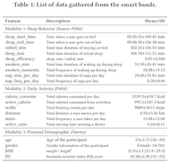

#  Sleep Analyze 

### Description
We want to build 'learning to rank model' for all insomnia patients


### Data
Table 1 displays the list of data features gathered by the Fitbit device and the user surveys. All features without "onbed_min" (which was excluded due to its strong correlation with other sleep features.) were used in this project. 
Sample data from four randomly selected users is uploaded in data folder. sample_data_sleeps_ORIGINAL.csv includes the data from Modality 1 and 2, and sample_meta-data_sleeps.csv includes the data from Modality 3.




### Required data format
1. data is .csv 
2. The first column is userId and other columns is feature data
3. For all users ,their experiment day need to be same
4. For example (user1 and user2 , Experiment day == 9day)


### Required packages
The code has been tested running under Python 3.6.6, with the following packages installed (along with their dependencies):

- numpy == 1.16.0
- pandas == 0.23.4
- pyprind == 2.11.2
- tensorflow == 1.12.0
- scikit-learn == 0.20.2

### Part 1. MISSING DATA IMPUTATION
##### Model parameter
You can set parameter by modifying GAIN/parameter.json file. In our paper, to make an imputation , we used parameters as 
follows.

```

"GAIN": 
      {"file_path": "....../sample_data_sleeps_ORIGINAL.csv", "save_path": "....../impute_data.csv",  "epoch": 20000}
      
```

##### How to Run
```
1. Setting the path of parameter.json in main.py
   (For example : If your parameter.json is located in 'user/Documents/data/parameter.json',you should set it as json_path in 
    main.py)
2. Setting parameter in parameter.json:
   (For example : If your sample_data_sleeps_ORIGINAL.csv is saved in 'user/Documents/data/sample_data_sleeps_ORIGINAL.csv',
    you should set it as parameter in parameter.json ; If you want to save imputed data,you should set the path whwere you       
    want to save a parameter in parameter.json)
3. python main.py -- After you finish step 1,2 , you can execute main.py and get imputed data.
                   
``` 

### Part 2. INSOMNIA RANKING
##### Model parameter
You can set parameter by modifying Isomnia_Ranking/parameter.json file. In our paper, to rank users, we used 
parameters as follows.

```
"Isomnia_Ranking": 
           {"file_path": "....../sample_data_sleeps_Imp-GAIN.csv", "threshold": 0.006, "main_effect_location": 4}
```

##### How to Run
```
1. Setting the path of parameter.json in main.py
   (For example : If your parameter.json is located in 'user/Documents/data/parameter.json',you should set it as json_path in 
    main.py)
2. Setting parameter in parameter.json:
   (For example : If your sample_data_sleeps_Imp-GAIN.csv is saved in 'user/Documents/data/sample_data_sleeps_Imp-GAIN.csv',
    you should set it as parameter in parameter.json ; If you want to save imputed data,you should set the path whwere you       
    want to save a parameter in parameter.json)
3. python main.py -- After you finish step 1,2 , you can execute main.py and get rank result.

```
